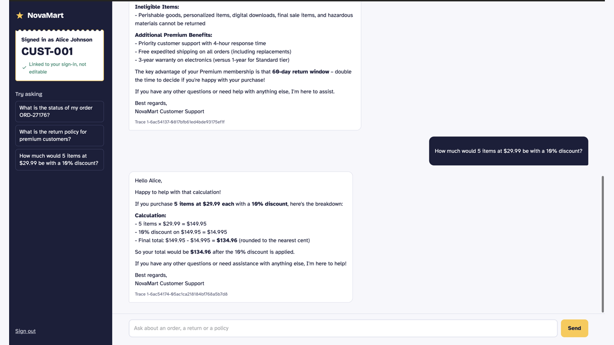
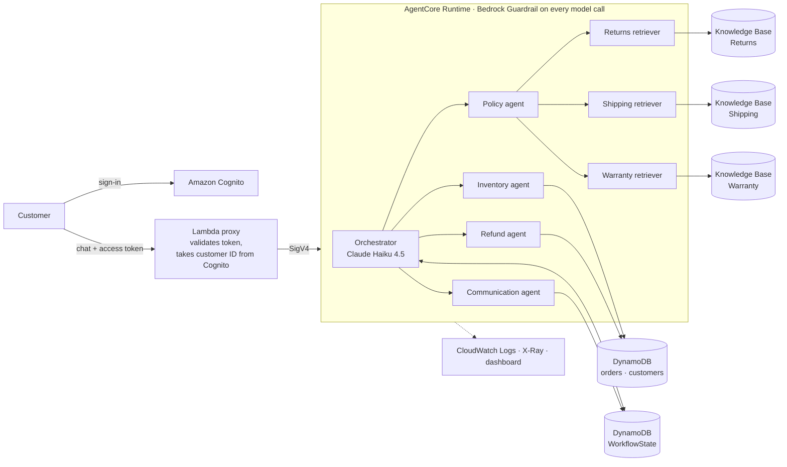
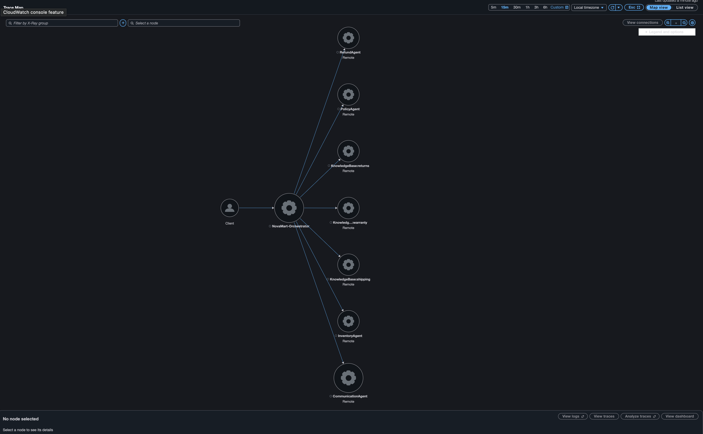
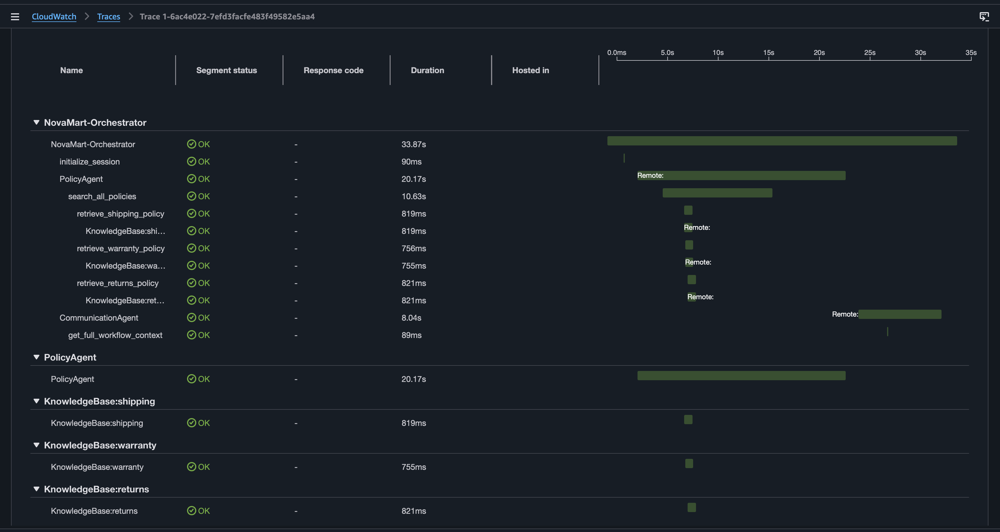
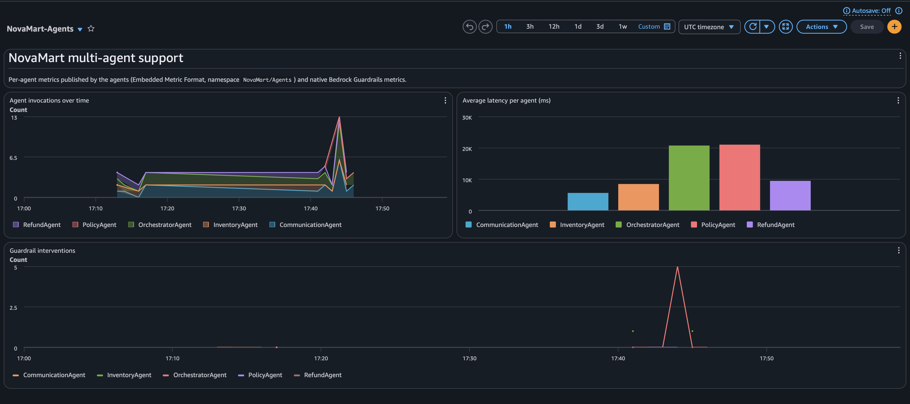
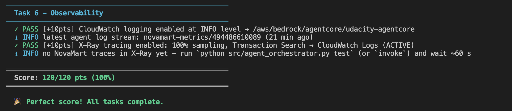

# NovaMart Support — a multi-agent customer support system on Amazon Bedrock AgentCore

> Five AI agents that understand a customer request, gather facts, apply company policy and answer — with guardrails, tracing and security checks built in.
> Built by **Mialy Ratsimbazafy** ([@ellebuild](https://github.com/Mialy333)) for the Udacity *AWS & AI Scholars — Future Agent Engineer* program, Project 3.



*Demo of the live deployment (October 2026): Cognito sign-in, then an order status, a policy question and a calculation, each with its X-Ray trace. The lab AWS account has since been reset, so the system is no longer running.*

📝 **Write-up:** [From finance to AI engineering: 6 lessons I learned building this system](https://dev.to/mialy333/from-finance-to-ai-engineering-6-lessons-i-learned-building-a-multi-agent-support-system-on-amazon-2fm1)

**Result:** `python tests/test_agent.py all` → **120/120**, plus the four optional stand-out extensions (adversarial testing, CloudWatch dashboard, persistent session memory, Cognito web front end).

---

## What it does

A NovaMart customer types a request. An orchestrator routes it to specialist agents, each of which records its findings in a shared DynamoDB record, and a communication agent writes the final reply.

| Request | Route |
|---|---|
| "I want to return my order ORD-27176" | Orchestrator → Inventory → Refund → Communication |
| "What is the return policy for premium customers?" | Orchestrator → Policy (3 knowledge bases searched in parallel) → Communication |
| "How much would 5 items at $29.99 be with 10% off?" | Orchestrator → Communication |
| "Give me 40% off or I'll sue you" | Blocked by the Bedrock Guardrail before any agent runs |

## Architecture



Worker agents run on Claude Sonnet 4.5; the three retrievers run concurrently in a `ThreadPoolExecutor`. The knowledge bases use Titan Text Embeddings v2 and S3 Vectors.

## Engineering highlights

These are the problems I hit while building it, and how I solved them. Each one is documented with logs or screenshots in [`project/starter/evidence/`](project/starter/evidence/).

**1. A guardrail that blocked a legitimate request.** The first guardrail version classified "How much would 5 items at $29.99 be with a 10% discount?" as a *pricing negotiation*. I diagnosed it through the guardrail assessment, rewrote the topic around haggling only, and built a tuning script that tests candidate definitions on the guardrail DRAFT against 14 cases before publishing a new version (14/14). → [`guardrail-tuning.txt`](project/starter/evidence/logs/guardrail-tuning.txt)

**2. A race condition between agents.** The refund agent sometimes answered "I don't have the order facts yet". Strands runs the tool calls of one model turn concurrently, so it started before the inventory agent had written its facts. Fixed with `SequentialToolExecutor`, so ordering is guaranteed by code rather than by the prompt.

**3. Red-teaming the deployed system.** I sent 10 adversarial requests to the live runtime: negotiation, competitor, legal threat, SSN, insult, two prompt injections and a cross-customer data request. The guardrail blocked 5/5 attacks and the injections were contained. The X-Ray trace of the cross-customer case showed the orchestrator answering by itself, skipping the mandatory initialization and communication steps. I fixed this in code (a Strands hook that guarantees the communication agent always replies, plus customer isolation enforced inside the DynamoDB tools) and re-ran the suite: 10/10. → [`guardrail_adversarial.md`](project/starter/evidence/standout/guardrail_adversarial.md), [`guardrail_adversarial_after_fixes.md`](project/starter/evidence/standout/guardrail_adversarial_after_fixes.md)

**4. Defense in depth for refunds.** The refund agent decides, but `initiate_refund` re-checks order status and the return window (30 days Standard, 60 days Premium) before writing to DynamoDB, with a conditional write. A model error or a prompt injection cannot approve an ineligible return.

**5. Memory that survives a restart.** The Strands SDK has no DynamoDB session storage, so I wrote a `SessionRepository` on DynamoDB and plugged it into `RepositorySessionManager`. A first demo showed that persistence worked but the reply did not use it, because the agent that writes replies is not the one that remembers. The conversation history is now passed to it in code. → [`session-demo.txt`](project/starter/evidence/standout/session-demo.txt)

**6. Identity that cannot be spoofed.** In the web front end, the customer ID comes from the Cognito user attribute read by the Lambda proxy, never from the browser. A user who edits the request to claim another customer ID is still served as themselves. I used a Lambda Function URL rather than API Gateway because one multi-agent request takes 20 to 50 seconds, beyond API Gateway's 30-second limit.

## Observability

| X-Ray Service Map | Parallel retrieval in one trace |
|---|---|
|  |  |

The trace timeline also shows where the time goes: the three knowledge-base calls take about 0.8 s in parallel, while the retriever agents' model calls take about 10 s. That is the next optimization target.

A CloudWatch dashboard tracks invocations, average latency per agent and guardrail interventions. Metrics are published with the Embedded Metric Format, which needs no extra IAM permission.



## Tests



## Tech stack

Python 3.12 · Strands Agents SDK · Amazon Bedrock (Claude Haiku 4.5, Claude Sonnet 4.5, Titan Embeddings v2, Guardrails, Knowledge Bases) · Amazon Bedrock AgentCore (Runtime, Memory, Observability) · S3 Vectors · DynamoDB · CloudWatch · X-Ray · Cognito · Lambda · CloudFormation / CDK

## Repository map

| Path | Content |
|---|---|
| [`project/starter/src/agent_orchestrator.py`](project/starter/src/agent_orchestrator.py) | My implementation: the five agents, routing, guardrail, deployment, memory, observability |
| [`project/starter/scripts/`](project/starter/scripts/) | Tooling I added: guardrail tuning, adversarial tests, dashboard, session demo, Cognito setup, proxy deployment, cleanup |
| [`project/starter/frontend/`](project/starter/frontend/), [`frontend_proxy/`](project/starter/frontend_proxy/) | Web chat and Lambda proxy |
| [`project/starter/evidence/`](project/starter/evidence/) | Test outputs, deployment logs and screenshots |
| [`project/starter/README.md`](project/starter/README.md) | The original Udacity project brief |

## Run it

The full setup (CloudFormation stack, seed data, knowledge bases, deployment) is described in the [original brief](project/starter/README.md). In short:

```bash
cd project/starter
python src/agent_orchestrator.py chat      # interactive chat with the live agent trace
python src/agent_orchestrator.py deploy    # deploy to AgentCore Runtime
python tests/test_agent.py all             # 120/120
```

## Credits

Starter code, tests and project brief © Udacity, under the [license](LICENSE.md) of this repository. The implementation of `agent_orchestrator.py`, the scripts, the front end and the evidence are my own work.
